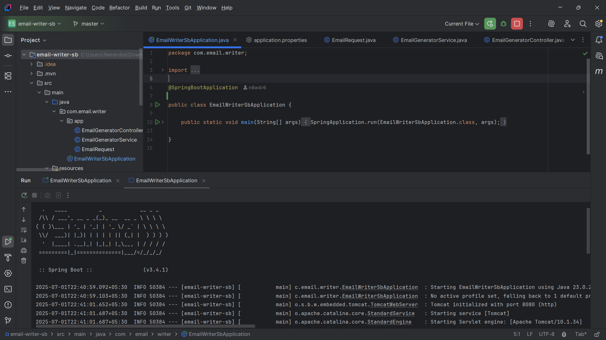
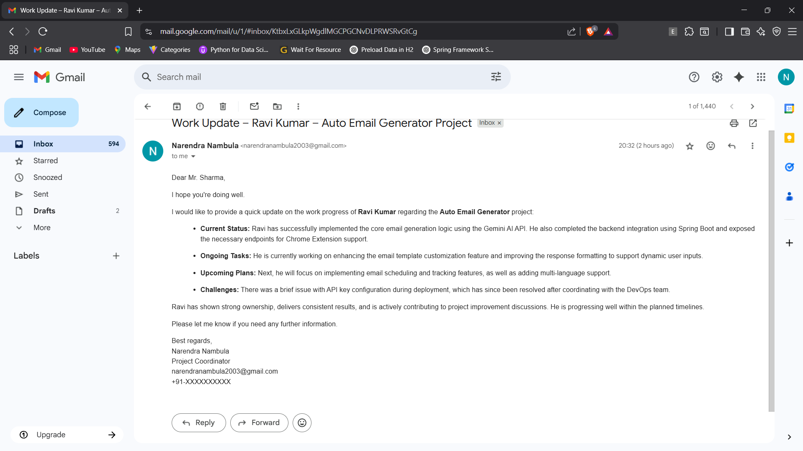
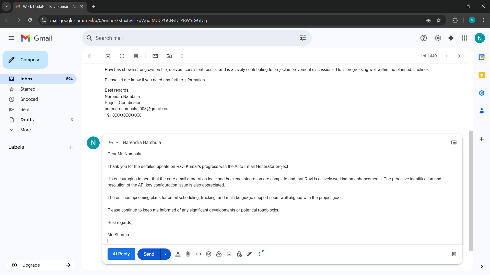
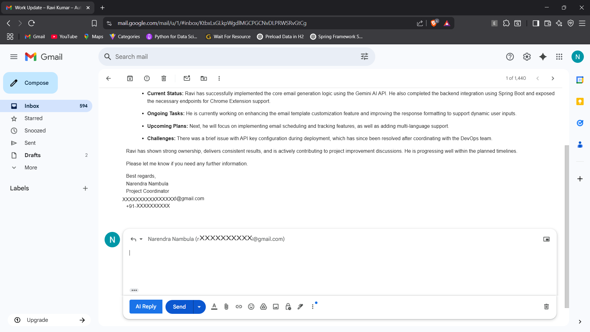

# 📧 Email Writer – Spring Boot + Gemini API

A Spring Boot-based web application that uses Google's **Gemini 2.0 Flash** model to generate **professional email replies** based on given input content and tone.

---

## 🚀 Features

- 🌐 RESTful API using Spring Boot
- ⚡ Reactive `WebClient` integration
- 🤖 AI-generated email replies using Google Gemini API
- 🎯 Tone customization (e.g., formal, friendly, persuasive)
- 🛡️ CORS enabled for frontend integration

---

## 🏗️ Tech Stack

- Java 17+
- Spring Boot 3+
- WebFlux (for non-blocking HTTP calls)
- Lombok
- Google Generative Language API (Gemini 2.0 Flash)

## 📸 Screenshots

### ✅ Spring Boot Server Running

### 📥 Email Input Provided

### ✨ AI-Generated Reply (1st Version)

### 🤖 AI Reply (Formatted)

### 🌐 Chrome Extension (Optional Integration)

